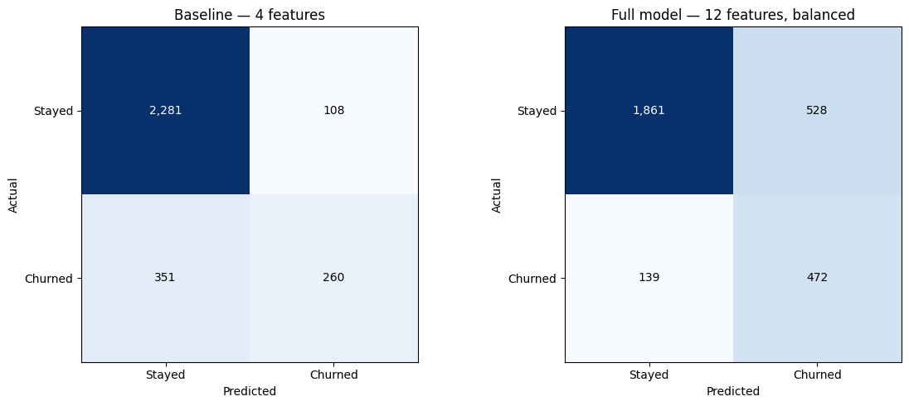
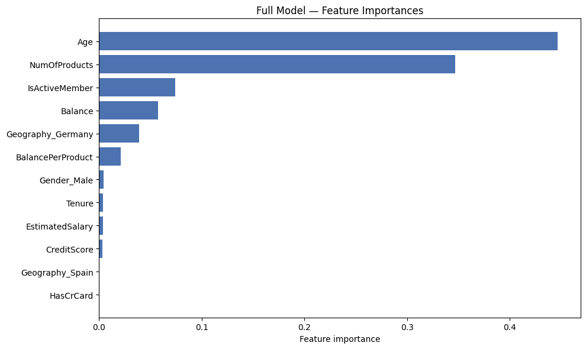

# Customer Churn Prediction — Decision Tree + ONNX + FastAPI

> A scikit-learn Decision Tree classifier trained on the Bank Customer Churn dataset, exported to ONNX format, and served behind a FastAPI `/predict` endpoint. Compares a 4-feature baseline against a 12-feature class-balanced model — both metrics live in this repo.


## What it does

Predicts whether a bank customer will churn (`Exited = 1`) given 10 raw customer attributes:

- `CreditScore`, `Geography`, `Gender`, `Age`, `Tenure`
- `Balance`, `NumOfProducts`, `HasCrCard`, `IsActiveMember`, `EstimatedSalary`

The full feature vector is built server-side at request time:
- **`BalancePerProduct`** = `Balance / (NumOfProducts + 1)` — engineered ratio
- **`Geography`** one-hot encoded to `Geography_Germany`, `Geography_Spain` (France is reference)
- **`Gender`** one-hot encoded to `Gender_Male` (Female is reference)

Final feature count fed to the model: **12** (see `feature_columns.json` for canonical order).


## Tech stack

| Layer | Tool |
|---|---|
| Language | Python |
| Model | scikit-learn `DecisionTreeClassifier` with `class_weight='balanced'` and CV-tuned `max_depth` |
| Data handling | pandas (one-hot via `get_dummies(drop_first=True)`) |
| Hyperparameter search | `GridSearchCV` — 5-fold CV optimizing F1 on the minority (churn) class |
| Model export | `skl2onnx` → `decision_tree.onnx` |
| Serving runtime | `onnxruntime` |
| HTTP layer | FastAPI + Pydantic |
| Server | Uvicorn |


## Pipeline

```
dataset.csv (10,000 rows, 79.6% / 20.4% class imbalance)
        │
        │  drop PII (RowNumber, CustomerId, Surname)
        │  + BalancePerProduct = Balance / (NumOfProducts + 1)
        ▼
  stratified train_test_split  (70 / 30, random_state=42)
        │
        ├─────── Baseline model ─────────────────────────────────────┐
        │  4 features: Age, NumOfProducts, Balance, BalancePerProduct│
        │  DecisionTreeClassifier(max_depth=5)                       │
        │  No class weighting                                        │
        │                                                            │
        └─────── Full model ─────────────────────────────────────────┤
           12 features (one-hot encoded Geography + Gender)          │
           class_weight='balanced'                                   │
           GridSearchCV over max_depth ∈ {3, 5, 7, 9, 11, None}      │
           5-fold CV, scoring='f1'                                   │
        ┌────────────────────────────────────────────────────────────┘
        │
        ▼
  skl2onnx.convert_sklearn → decision_tree.onnx (12-feature input)
        │
        ▼
  FastAPI /predict endpoint
  → ort.InferenceSession(decision_tree.onnx) at startup
  → Pydantic input validation + server-side encoding
  → returns { prediction, churn_probability }
```


## Results

### Side-by-side comparison (test set, 3,000 rows)

| Metric | Baseline (4 features) | Full (12 features, balanced) | Δ |
|---|---|---|---|
| Accuracy | 0.847 | 0.778 | −0.069 |
| ROC-AUC | 0.840 | **0.852** | +0.012 |
| Churn precision | 0.71 | 0.47 | −0.235 |
| **Churn recall** | 0.43 | **0.77** | **+0.347** |
| Churn F1 | 0.53 | **0.59** | +0.055 |

### Why accuracy went down — and why the full model is still the right one

The 79.6 / 20.4 class imbalance means a trivial "always predict no churn" classifier scores ~80% accuracy. The baseline benefits from this — most of its accuracy comes from being right about the easy majority class. **The full model trades some of that "safe" accuracy for substantially better recall on the actual churn class** — 0.43 → 0.77, a **+79% relative improvement**. It catches 77% of customers who will churn vs. the baseline's 43%.

For a customer-retention use case, false negatives (missed churners) cost real money — false positives (unnecessary retention email) don't. Recall on the minority class is the right metric. **ROC-AUC** (which is invariant to class balance) confirms the full model is the better discriminator overall: 0.852 vs. 0.840.

CV-selected best `max_depth`: 5 (same as the baseline — the lift comes from the additional features + class balancing, not deeper trees).






## API

The FastAPI service exposes one endpoint:

| Method | Path | Body | Returns |
|---|---|---|---|
| `POST` | `/predict` | `{ CreditScore, Geography, Gender, Age, Tenure, Balance, NumOfProducts, HasCrCard, IsActiveMember, EstimatedSalary }` | `{ prediction, churn_probability }` |

Input is validated by a Pydantic `BaseModel`. Geography is constrained to `France` / `Germany` / `Spain`, Gender to `Male` / `Female`. The handler computes `BalancePerProduct` and the one-hot dummies server-side, then runs the 12-feature vector through ONNX Runtime.


## Files

```
Churn-Prediction-Decision-Tree/
├── dataset.csv              Bank Customer Churn dataset (10,000 rows)
├── train.py                 Training pipeline — baseline vs full + ONNX export + plots
├── model.ipynb              Original exploratory notebook (kept for reference)
├── main.py                  FastAPI serving layer
├── decision_tree.onnx       Exported full-feature model (tracked)
├── feature_columns.json     Canonical feature order (tracked, sanity-checked at startup)
├── confusion_matrix.png     Baseline vs full confusion matrices (generated)
├── feature_importance.png   Full-model feature importances (generated)
└── requirements.txt         Python dependencies
```
